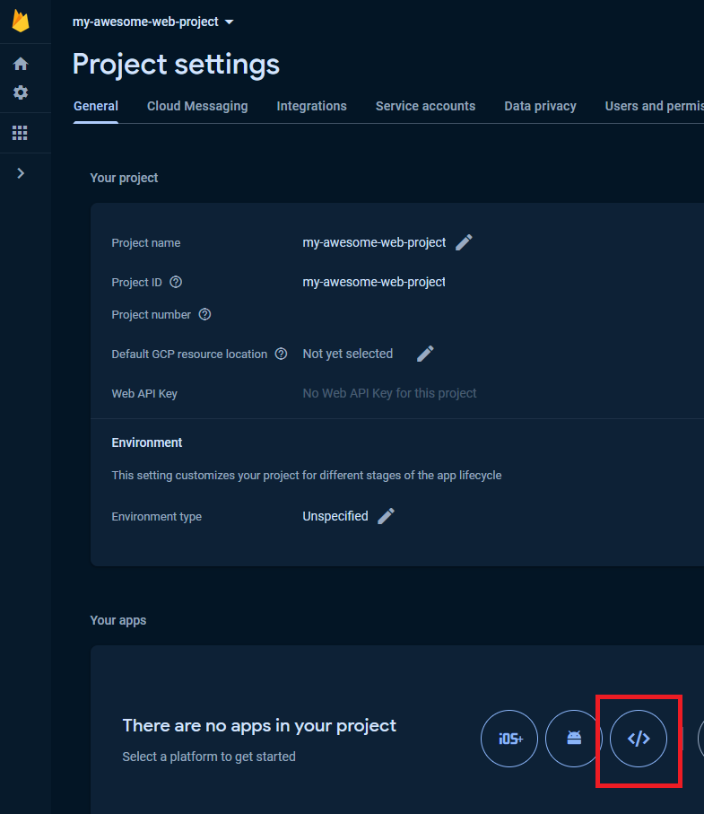
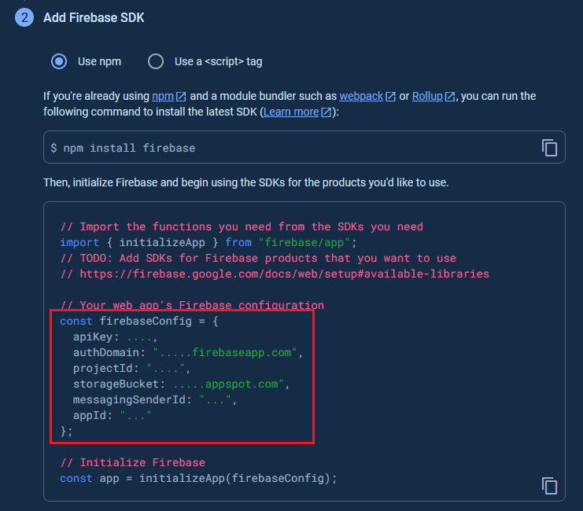
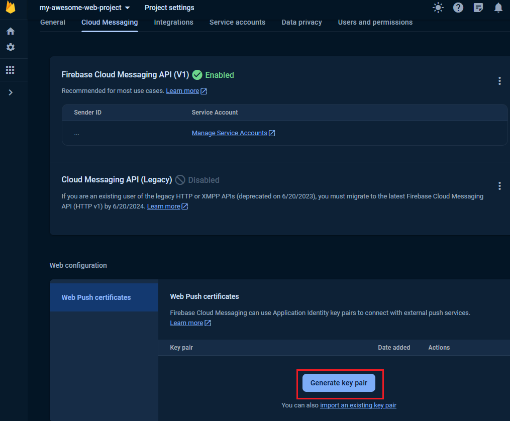
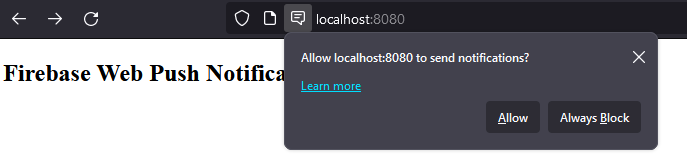
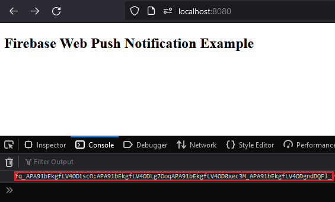
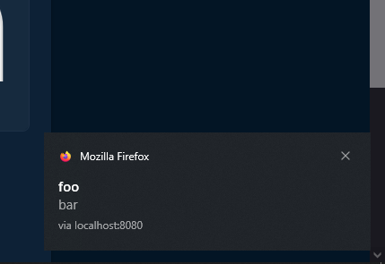

# gt-fcm-wrapper

Wrapper for Web Push Notifications via Firebase Cloud Messaging 

## Prerequisites

If not already done, a project in Firebase is required. Go to https://console.firebase.google.com/ and create your project. 

Add your web app:



Copy the Firebase configuration:



Finally, get the Vapid Key via Web Push Certificates:



## Prepare your Web App

Put the lib in your application. If different, you must adjust the paths everywhere! E.g.:

* /lib/gt-fcm-wrapper/gt-fcm-init-1.0.0.min.js
* /lib/gt-fcm-wrapper/gt-fcm-worker-1.0.0.min.js

Create your custom Service Worker file e.g. /js/sw.js and update the Firebase configuration:

```
const firebaseConfig = {
    apiKey: "",
    projectId: "",
    messagingSenderId: "",
    appId: ""
};
importScripts('/lib/gt-fcm-wrapper/gt-fcm-worker-1.0.0.min.js');
```

Finally, update your page to get the desired Device Token. Please remember the Firebase configuration and the Vapid Key:

```
<script type="module">
    import { startMessaging } from '/lib/gt-fcm-wrapper/gt-fcm-init-1.0.0.min.js'
    const config = {
        firebaseConfig: {
            apiKey: "...",
            projectId: "...",
            messagingSenderId: "...",
            appId: "...",
        },
        vapidKey: "...",
        serviceWorkerPath: '/js/sw.js'
    };
    startMessaging(config).then(token => {
        console.log("Token", token);
        // TODO: Persist the Device Token in your backend
    });
</script>
```

## Behavior of your Web App

You will receive a notification after successful setup. This should be accepted:



Finally, after page refresh the token is shown in Console:



## Send Web Push Notifications

```
// TODO: provide the client token
var registrationToken = "...";
var message = new Message()
{
    Data = new Dictionary<string, string>()
    {
        { "title", "foo" },
        { "body", "bar" },
    },
    Token = registrationToken,
};
string response = await FirebaseMessaging.DefaultInstance.SendAsync(message);
Console.WriteLine("Successfully sent message: " + response);
```

Voilà, the message is received by your Browser:



### Further information on sending messages

https://firebase.google.com/docs/cloud-messaging/send-message
